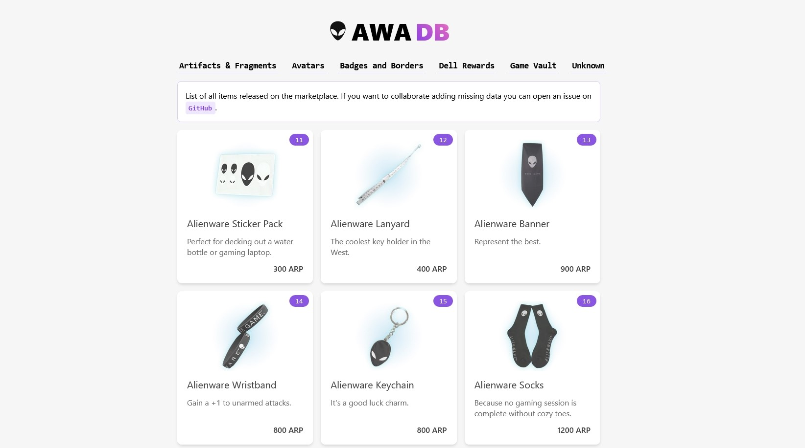

# Alienware Arena Marketplace DB

## Description

This project serves as a comprehensive database for the Alienware Arena Marketplace. It is a dedicated website designed to facilitate item search and provide pricing information. The website encompasses an extensive collection of items available on the Alienware Arena Marketplace, including both currently available items, those that have been removed from the marketplace, and items that are limited to specific markets such as Alienware Arena Rewards exclusive to the United States and the United Kingdom.

## TODO

- Use Typescript in [Tailwind](https://tailwindcss.com/blog/tailwindcss-v3-3#esm-and-typescript-support) config file
- Dark mode
- Price history
- Search items by name and id
- Price history
- Item details page

## Bugs

- Prettier: importOrder don't put external types first
- Critters: critical CSS is not removed from the CSS file

## Licence

The codebase of this project is distributed under the [GNU General Public License (GPL) version 3.0](LICENCE). However, it is important to note that certain resources utilized within the project may be subject to different licenses. It is recommended to review the specific licenses associated with each resource to ensure compliance with their respective terms and conditions.

## Credits

- [Favicon](https://commons.wikimedia.org/wiki/File:Alien01.svg)
- [Image unknown item](https://commons.wikimedia.org/wiki/File:GHS-pictogram-unknown.svg)
